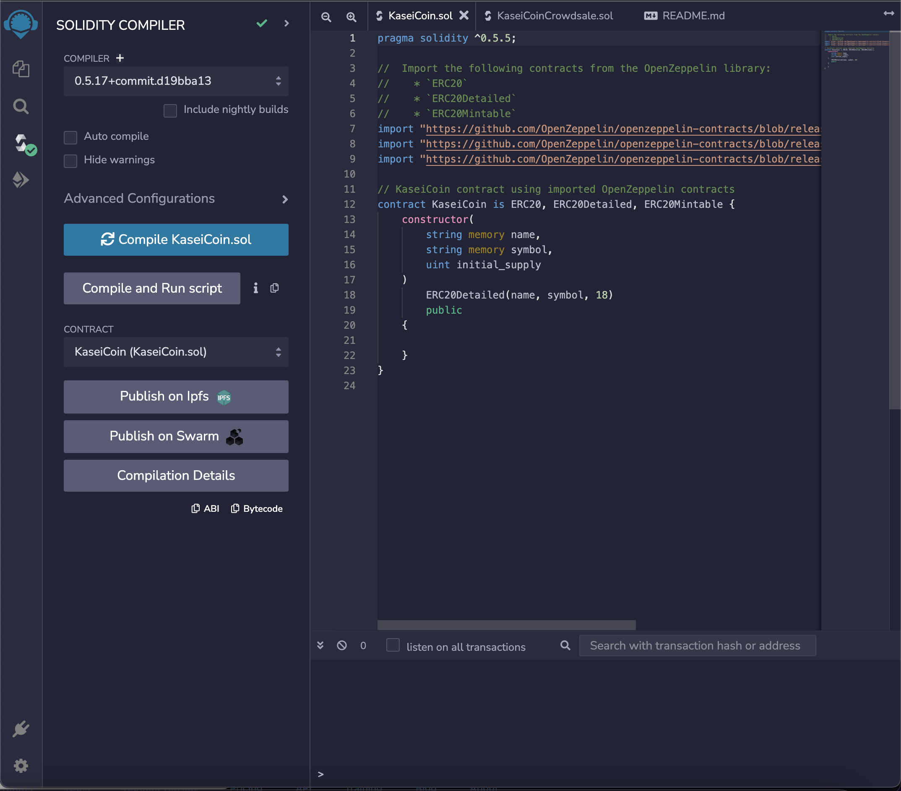
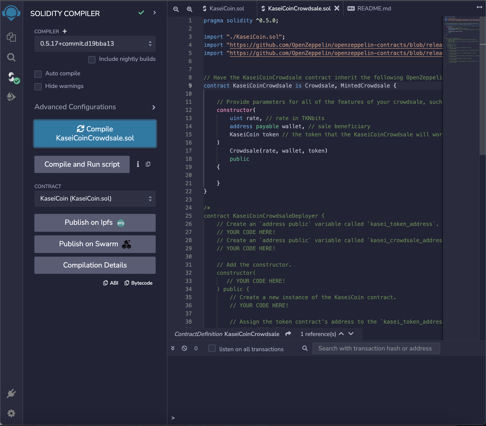
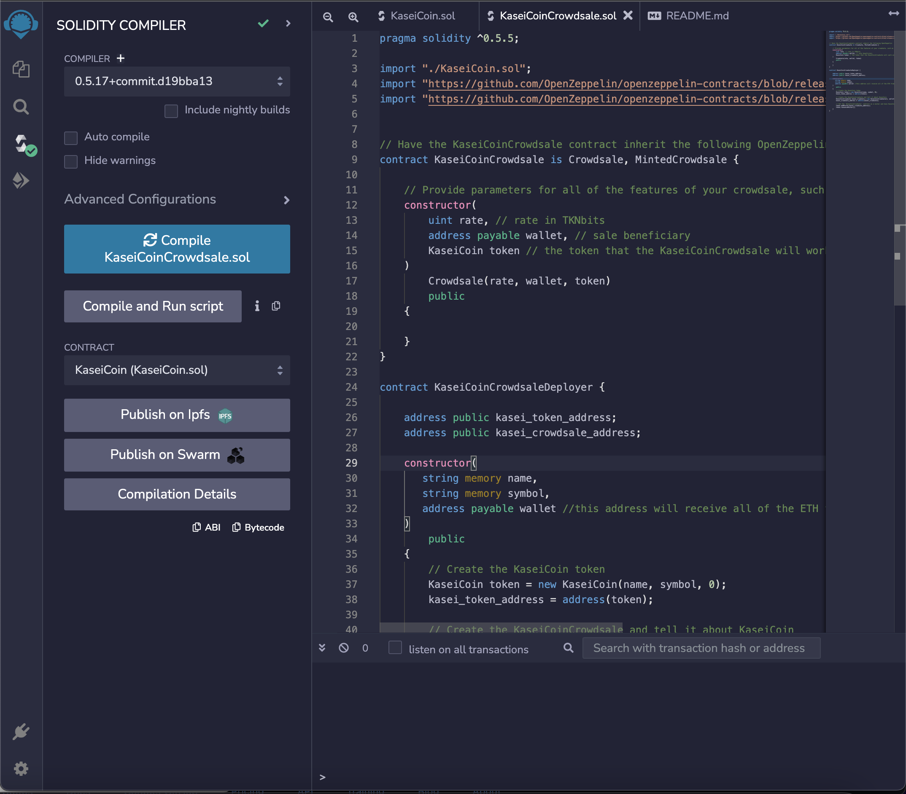

# kaseicoin
A smart contract for a fictional new monetary system focused around a Mars token, KaseiCoin.

# Evaluation Evidence

The above image shows the successful compilation of the KaseiCoin contract.

This shows the successful compilation of the KaseiCoinCrowdsale contract.

This shows the successful compilation of the KaseiCoinCrowdsaleDeployer contract.