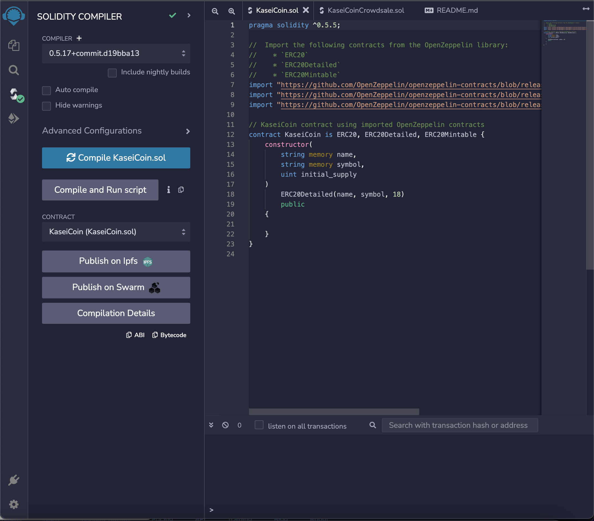
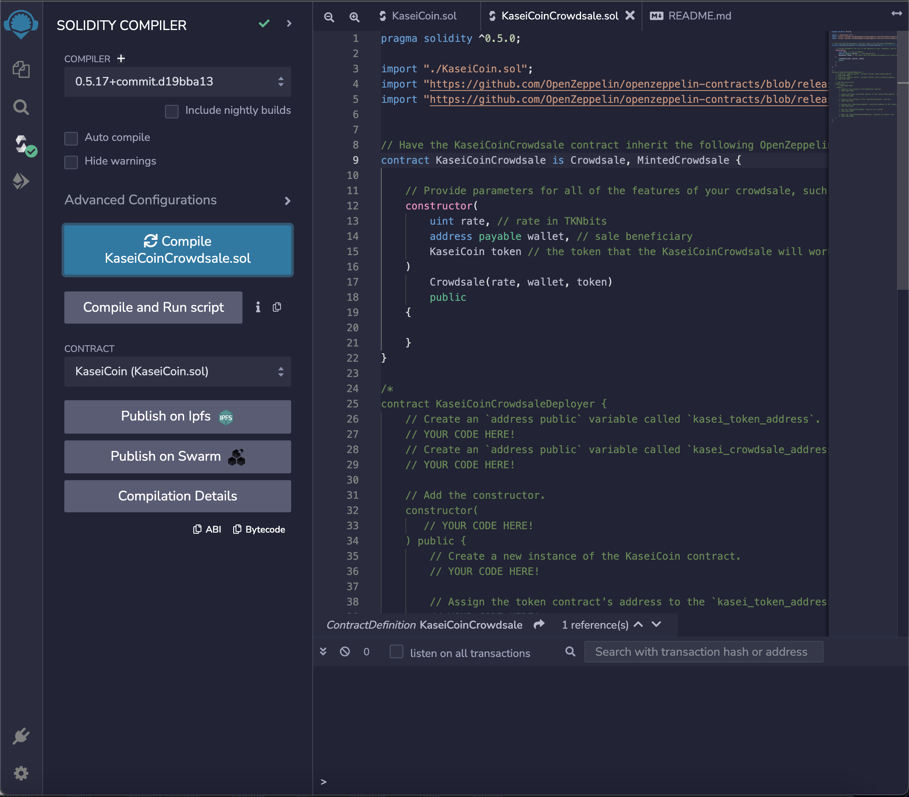
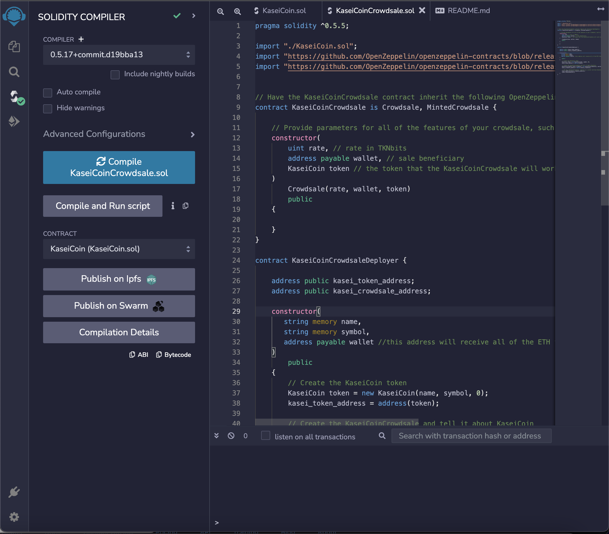
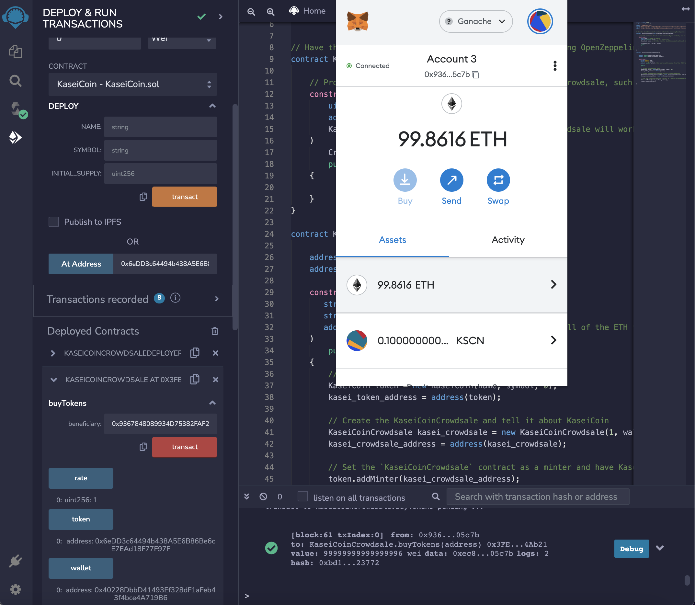

# kaseicoin
A smart contract written in Solidity for a fictional new monetary system focused around a Mars ERC20 token, KaseiCoin.

The main smart contract consists of a deployer with two smart contracts within: a crowdsale contract and a contract creating the KaseiCoin.  The contracts satisfy ERC20 requirements using OpenZeppelin.  The folder, Evaluation Evidence, contains images depicting the deploying of each contract, as well as evidence of the creation of the coin and the execution of the crowdsale.

# Evaluation Evidence

The above image shows the successful compilation of the KaseiCoin contract.

This shows the successful compilation of the KaseiCoinCrowdsale contract.

This shows the successful compilation of the KaseiCoinCrowdsaleDeployer contract.

.1 KaseiCoin in a user's MetaMask wallet.  Purchased from this very crowdsale, this user is an early adopter that will be rewarded very handsomely in the new economy on Mars.